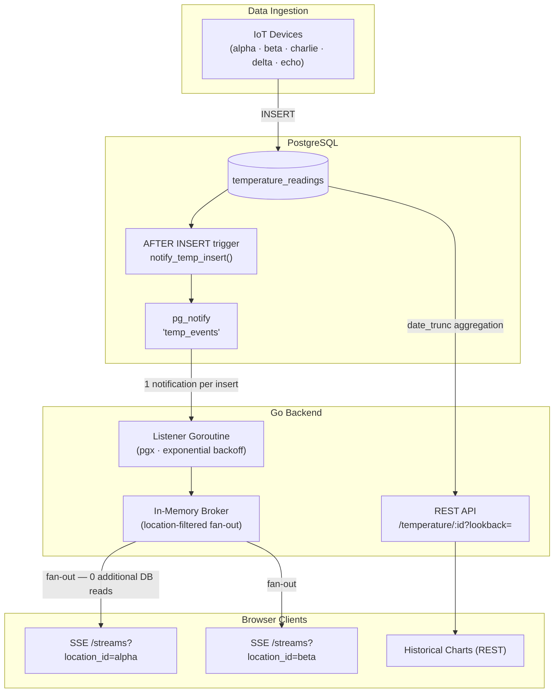

# gobroker
Broker and charts for realtime analytics with go. Uses a combination of server side events and REST APIs to 
demonstrate real-time capabilities.



### Backend
On dev, start the go server with live reload enabled in a devcontainer with
- `cd backend & air` from the root directory
    - Use `air -- server --port 8080` to specify a custom port from the backend directory.

Example insert statement:
```sql
INSERT INTO public.temperature_readings (location_id,device_id,value) 
VALUES ('alpha','device-alpha',20);
```

Two temperature endpoints:
| Endpoint | Purpose | Example |
| :------- | :------ | :------ |
| **GET** `/streams/?location_id=<id>` | SSE stream — live events pushed via LISTEN/NOTIFY | `curl localhost:8080/streams?location_id=alpha` |
| **GET** `/temperature/{location_id}?lookback=24h\|1wk\|1mo\|3mo` | Historical data, aggregated by minute/hour/day depending on lookback window | `curl localhost:8080/temperature/alpha?lookback=24h` |

Additional options include
> TimescaleDB materialized view [continuous aggregates](https://www.tigerdata.com/docs/api/latest/continuous-aggregates/create_materialized_view#:~:text=Tiger%20Cloud:%20Performance%2C%20Scale%2C,In%20TimescaleDB%20v2.).

### Frontend
- Install dependencies - `npm install`
- Start the dev server - `npm run dev`